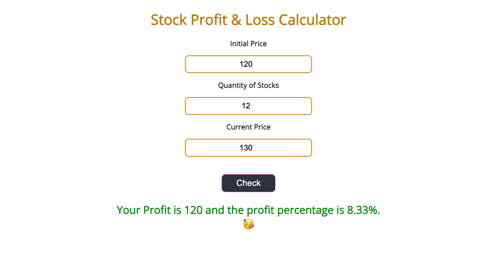

# Stock Profit/Loss Calculator

- This is a stock Profti/Loss Calculator which takes intitial price, quantity of
  stocks bought and current price then displays the profit or loss incurred.
- This app is made using vanilla js.

## How to use

- Enter initial price
- Enter quanity of stocks bought
- Enter current price of the stock
- Click on the check button.
- Proft or Loss will be displayed in Green or red color respectively

## Tech Stack

- HTML
- CSS
- JavaScript

## Live Project

[Live Project](https://priyanshu-profit-loss-stock.netlify.app/)

## Screenshots

## Connect with me

- [LinkedIn](https://www.linkedin.com/in/priyanshu844/)
- [Twitter](https://twitter.com/Priyanshu844)
- [GitHub](https://github.com/PriyanshuSinghR)
- [Portfolio](https://priyanshu-portfolio.netlify.app/)
